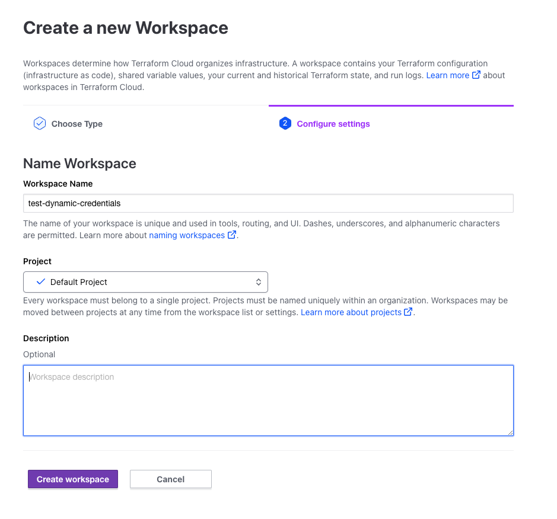
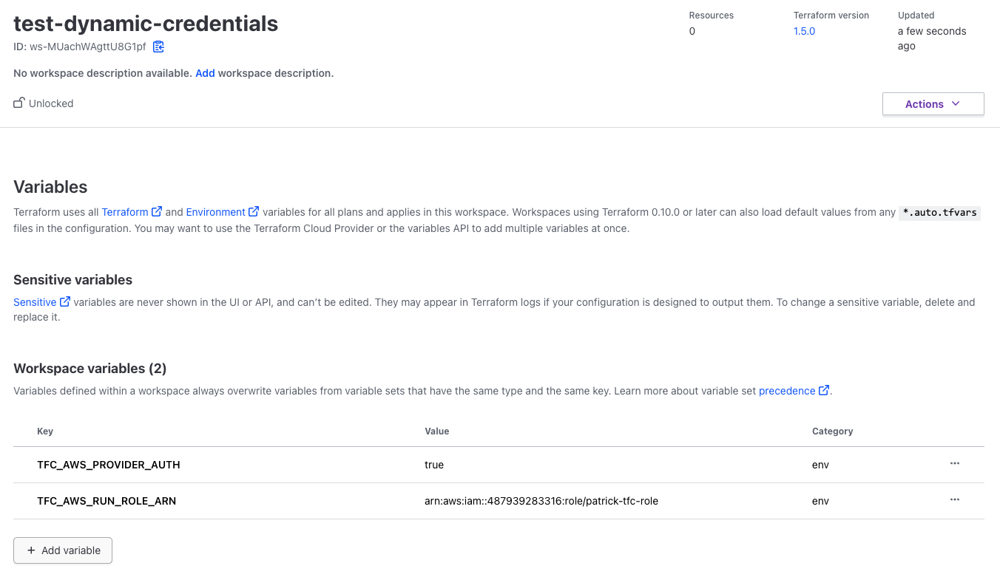
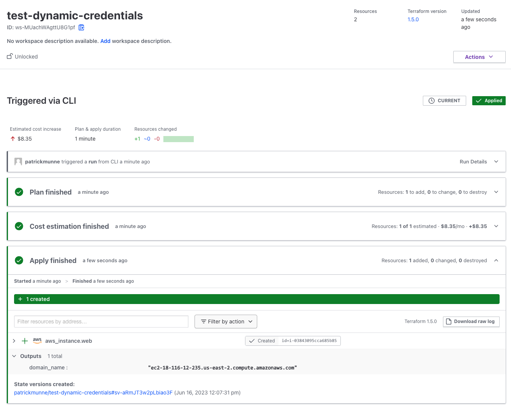

# terraform_dynamic_credentials

This repository creates dynamic credentials between AWS and Terraform Cloud. 

This is based on the learning tutorial found [here](https://developer.hashicorp.com/terraform/tutorials/cloud/dynamic-credentials)

# How to 

## create the trust relationship

- Clone this repository to your local machine

```
https://github.com/munnep/terraform_dynamic_credentials.git
```

- Go into the directory

```
cd terraform_dynamic_credentials/aws/trust
```
- create the trust relationship for terraform cloud and aws using some terraform code executed on your local machine
- Set you aws credentials
```
export AWS_ACCESS_KEY_ID=
export AWS_SECRET_ACCESS_KEY=
export AWS_SESSION_TOKEN=
```
- change the values in `variables.tf` if you are using Terraform Enterprise instead of Terraform Cloud
- create a file called `terraform.tfvars` with the following 
```
tfc_organization_name = "patrickmunne"
tfc_workspace_name    = "test-dynamic-credentials"
```
- create the profiles/roles and the trust relationship
- terraform init
```
terraform init
```
- terraform apply
```
Apply complete! Resources: 4 added, 0 changed, 0 destroyed.

openid_claims = {
  "StringEquals" = {
    "app.terraform.io:aud" = "aws.workload.identity"
  }
  "StringLike" = {
    "app.terraform.io:sub" = "organization:patrickmunne:project:Default Project:workspace:test-dynamic-credentials:run_phase:*"
  }
}
role_arn = "arn:aws:iam::487939283316:role/patrick-tfc-role"
```
- You now have a trust relation between terraform cloud and organization you defined
- Makes notes of the output as you will need it at a later point


## Create workspace in Terraform Cloud

- Login to terraform Cloud
- Create a new workspace called `test-dynamic-credentials`
  
- Create the following variables to use the dynamic credentials on this workspace


| Variable category | Key | Value | Sensitive |
| --- |  --- |  --- |  --- |
| Environment variable | `TFC_AWS_PROVIDER_AUTH` | `true` | No |
| Environment variable | `TFC_AWS_RUN_ROLE_ARN` | `role_arn output from previous run` | No |

  
- 
- Go into the directory infra
```
cd ../infra
```
- Change the variables in `terraform.tf` to match your workspace you created
- We will do a run and see it uses the dynamic credentials to authenticate to AWS
- Do a terraform init
```
terraform init
```
- terraform apply
```
terraform apply
```
- you should see the environment getting created  
  
- Destroy the resource
```
terraform destroy
```
- Go into the trust relationship directory
```
cd ../trust
```
- Destroy this again
```
terraform destroy
```


